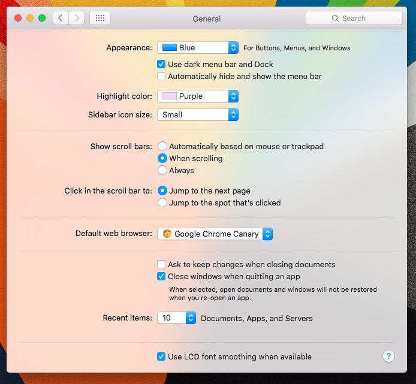

# zestyWin - [Download](https://github.com/w0lfschild/zestyWIn/raw/master/zestyWin.zip)

 

# Information:

- zestyWin is a SIMBL plugin that tries to add Vibrancy to every application window on OS X
- Designed for 10.10+
- Author: [w0lfschild](https://github.com/w0lfschild)

# Warnings:

- Some applications may look bad or crash
- Applications that do no use NSWindow will not be effected
- To blacklist zestyWin from load for an app add that app bundle ID to the zestyWin preference file
- You can accomplish this by running the following terminal command (replace Steam with your app):
    - `defaults write com.w0lf.zestyWin $(osascript -e 'id of app "Steam"') 0`

- Automatically blacklisted applications include:
    - Finder 
    - TextEdit
    - iTunes
    - Terminal
    - Sublime Text
    - Xcode
    - Notification Center
    - cDock

# Installation:

1. Install SIMBL
2. Download zestyWin bundle
3. Unzip download
4. Copy to ``/Library/Application Support/SIMBL/Plugins``
5. Restart applications to have zestWin plugin loaded into them
	
### License:
Pretty much the BSD license, just don't repackage it and call it your own please!    
Also if you do make some changes, feel free to make a pull request and help make things more awesome!
